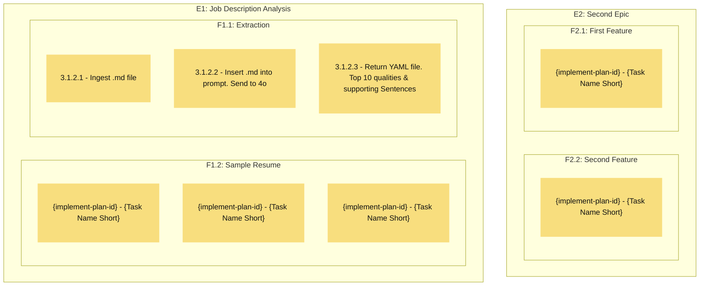

Goal: Visualize the Implement plan in a mermaid chart
Actions:
* Use the mermaid template below
* **REQUIRED** - Follow % IMPORTANT LAYOUT NOTES instructions in template.
* **REQUIRED** - Shorten Epic, Feature, and Task Names to text in the display. Be Concise. Remove extra a, to, in, for, etc. 


```mermaid
flowchart TD
    % IMPORTANT COMMENT NOTES:
    % 1. The percentage sign (%) indicates a comment for the LLM
    % 2. The LLM MUST REMOVE all comments in its final output for Humans
    
    % IMPORTANT LAYOUT NOTES:
    % 1. Epics are defined in the CODE BOTTOM TO TOP but will DISPLAY LEFT-TO-RIGHT
    % 2. Features within each epic are defined in the CODE BOTTOM TO TOP but will DISPLAY LEFT-TO-RIGHT
    % 3. Nodes within features are defined in the code TOP-TO-BOTTOM will display TOP-TO-BOTTOM 


    % Custom node styling for better visibility
    classDef tallNode fill:#F8DE7E,stroke:#000,color:#111,stroke-width:0,padding:1em;

    % Epic Template Structure
    % {Importance Level}: Must Have, Should Have, Could Have, Nice to Have
    % {Status}: Planned, In Progress, Completed
    subgraph "E{EpicNumber}: {EpicTitle} [{Status}]"
        % Feature Subgraph - defined BOTTOM-UP for correct left-to-right display
        subgraph "F{EpicNumber}.{FeatureNumber}: {FeatureTitle} [{Status}]"
            % Nodes are written TOP-TO-BOTTOM and maintain that order
            % Use concise, descriptive task names
            % Include reference ID, short description
            % Add class for consistent styling
            id{EpicNumber}{FeatureNumber}{NodeNumber}["{ReferenceID} - {TaskDescription}"]:::tallNode
        end
    end

    % Additional Epic Subgraphs follow same pattern...
```

% Importance Level Framework:
% Must Have: Critical to project success, non-negotiable
% Should Have: Important but not critical, high priority
% Could Have: Beneficial but not necessary
% Nice to Have: Lowest priority, optional enhancements

% Example Filled Template


% Recommended Best Practices:
% - Use clear, actionable task descriptions
% - Maintain consistent reference ID format
```