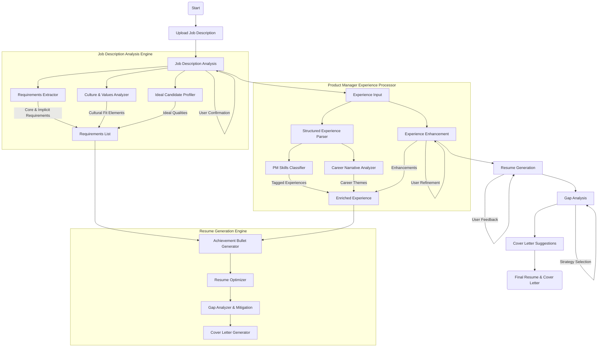

# ResumeCoach Product Design Document

## Product Vision

ResumeCoach is an agentic AI application that helps product managers efficiently tailor their resumes to specific job descriptions through automated analysis and generation, saving time and improving application effectiveness.

## Workflow


## User Problems
1. **Time Consumption** - Adapting resumes to job descriptions is tedious and time-intensive
2. **Content Optimization** - Difficulty crafting compelling, relevant copy that highlights appropriate experience
3. **Focus Management** - Losing track of critical requirements during the adaptation process

## Solution Architecture

### 1. Job Description Analysis Engine

#### Components:
- **Requirements Extractor**
  - Parses explicit requirements (technical skills, experience level, domain expertise)
  - Identifies implicit requirements (leadership qualities, problem-solving approaches)
  - Classifies requirements by priority (must-have vs. nice-to-have)

- **Culture & Values Analyzer**
  - Extracts company culture signals from job description
  - Maps cultural elements to candidate attributes
  - Identifies key value alignment opportunities

- **Ideal Candidate Profiler**
  - Synthesizes top 10 qualities of the ideal candidate
  - Generates sample profile highlights for the "perfect" candidate
  - Creates achievement templates aligned with role expectations


### 2. Product Manager Experience Processor

#### Components:
- **Structured Experience Parser**
  - Ingests experience in STAR-like format (Situation, Objectives, Actions, Results)
  - Extracts key metrics and achievements
  - Maps experiences to common PM competencies

- **PM Skills Classifier**
  - Categorizes experiences by PM skill domains (discovery, execution, analytics, leadership)
  - Identifies evidence of strategic vs. tactical skills
  - Maps technical and domain expertise

- **Career Narrative Analyzer**
  - Identifies career progression themes
  - Maps career transitions and growth
  - Extracts unique value proposition elements


### 3. Resume Generation Engine

#### Components:
- **Achievement Bullet Generator**
  - Creates compelling bullet points that connect experience to job requirements
  - Optimizes language for impact and relevance
  - Ensures metrics and outcomes are highlighted

- **Resume Optimizer**
  - Prioritizes experiences based on relevance to job description
  - Structures resume sections for maximum impact
  - Manages length and detail optimization

- **Gap Analyzer & Mitigation**
  - Identifies gaps between experience and job requirements
  - Suggests alternative framing for transferable skills
  - Generates cover letter points to address gaps


## Implementation Approach

### Phase 1: Job Description Analysis
1. Develop core parsing algorithms for explicit requirements
2. Build implicit requirement identification capabilities
3. Create ideal candidate profile synthesizer
4. Implement testing using sample job descriptions
5. Add refinement capabilities through user feedback

### Phase 2: Experience Processing
1. Build structured experience schema and parser
2. Develop PM skills classification taxonomy
3. Create career narrative analyzer
4. Implement experience repository with retrieval mechanisms
5. Add experience clarification/enhancement prompts

### Phase 3: Resume Generation
1. Develop achievement bullet generator
2. Build resume structure optimizer
3. Create gap analysis and mitigation engine
4. Implement iterative feedback mechanisms
5. Add final polish capabilities

## User Experience Flow

1. **Job Upload & Analysis**
   - User uploads job description
   - System analyzes and presents key findings
   - User confirms or adjusts analysis

2. **Experience Input**
   - User inputs/uploads structured experience entries
   - System suggests clarifications and enhancements
   - User refines experience description

3. **Resume Generation**
   - System generates tailored resume content
   - User reviews and provides feedback
   - System iterates based on feedback

4. **Gap Analysis & Mitigation**
   - System identifies experience gaps
   - Suggests mitigation strategies and cover letter points
   - User selects preferred approaches

## AI Prompting Strategy

### Prompt Framework for Job Analysis:
```
Analyze this product manager job description:
1. Extract explicit requirements (skills, experience, education)
2. Identify implicit requirements (qualities, approaches, values)
3. Determine key performance expectations
4. Identify cultural signals and company values
5. Synthesize the profile of an ideal candidate with top 10 qualities
6. Rank requirements by likely importance to hiring decision

[JOB DESCRIPTION]
```

### Prompt Framework for Experience Enhancement:
```
Enhance this product management experience entry to maximize impact and clarity:
1. Identify missing context that would strengthen this entry
2. Suggest improvements for quantifying results
3. Recommend clearer connections between actions and results
4. Note any PM-specific terminology that could strengthen the entry

[EXPERIENCE ENTRY]
```

### Prompt Framework for Resume Generation:
```
Generate optimized resume content based on this job description and experience:
1. Create 3-5 achievement bullets that best align with the job requirements
2. Prioritize experiences that demonstrate the top requirements
3. Suggest metrics and outcomes to emphasize
4. Identify potential concerns/gaps and suggest mitigation approaches

[JOB ANALYSIS]
[EXPERIENCE ENTRIES]
```

## Quality Assurance Mechanisms

1. **Requirement Validation**
   - Cross-check extracted requirements against job description
   - Validate classification of must-have vs. nice-to-have
   - Ensure complete coverage of both explicit and implicit requirements

2. **Achievement Verification**
   - Verify achievements maintain factual accuracy
   - Ensure metrics are presented meaningfully
   - Check that language is specific and concrete

3. **Resume Effectiveness Checks**
   - Evaluate keyword optimization for ATS systems
   - Assess narrative coherence and flow
   - Verify alignment between resume content and job requirements

## Future Enhancements

1. **Company Research Integration**
   - Incorporate company website analysis
   - Add competitor and industry research
   - Include company culture research from review sites

2. **Interview Preparation Module**
   - Generate likely interview questions based on resume
   - Prepare talking points for experience elaboration
   - Develop stories that demonstrate key requirements

3. **Application Tracking**
   - Monitor application status and outcomes
   - Analyze response patterns
   - Recommend resume adjustments based on outcomes