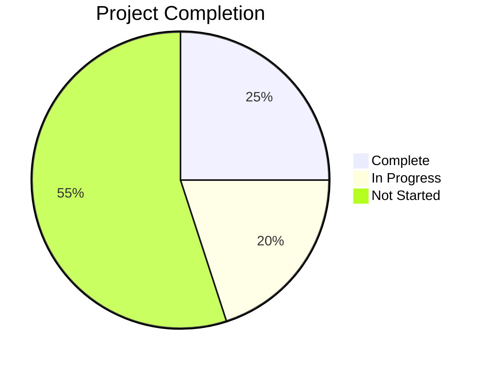

# Progress: ResumeCoach

## Current Status

ResumeCoach is in **early development** with the first phase of functionality implemented. The project has established its core architecture and successfully implemented the initial job description analysis workflow. The overall completion status is approximately **25%** of the full vision.

## What Works

### ✅ Job Description Analysis
- Job description ingestion from text files
- LLM-based analysis using structured prompts
- Extraction of job metadata (company, position, requirements)
- Identification of top qualities for the ideal candidate
- Output of structured YAML in both machine and human-readable formats
- Unique ID generation for job processing instances
- Error handling with retry logic for LLM outputs

### ✅ Core Infrastructure
- PocketFlow integration for workflow orchestration
- Node-based processing architecture
- Shared memory pattern for state management
- File I/O utilities for data persistence
- LLM service abstraction layer
- YAML validation and formatting utilities

## What's In Progress

### 🔄 Resume Parsing
- Design work started for resume text ingestion
- Planning structured format for work experience
- Researching optimal resume section categorization

### 🔄 Documentation
- Initial project documentation created
- Memory bank structure established
- System architecture documentation in progress

## What's Left to Build

### ❌ Experience Processing
- Work experience ingestion in structured format
- Experience categorization and tagging
- Skills and accomplishments extraction

### ❌ Experience Matching
- Matching algorithm between job requirements and experiences
- Relevance scoring for experience items
- Gap analysis between requirements and qualifications

### ❌ Resume Generation
- Tailored bullet point generation
- Resume structure optimization
- Complete resume text assembly
- Output formatting options

### ❌ User Experience
- Command-line interface refinements
- Progress feedback during processing
- Interactive resume refinement

## Known Issues

1. **LLM Output Consistency**
   - Occasional formatting inconsistencies in LLM outputs
   - Potential for validation failures requiring retries
   - Workaround: Implemented retry logic with validation

2. **Limited Input Validation**
   - Minimal validation on input job description format
   - Potential issues with unusual job description structures
   - Workaround: Using example-driven prompting to guide LLM

3. **Sequential Processing**
   - Current implementation is primarily sequential
   - Limited parallelization of workflow steps
   - Impact: Longer processing times for complex inputs

## Next Milestones

### Milestone 1: Resume Ingestion (Target: +2 weeks)
- Complete resume parsing implementation
- Add structured work experience format
- Implement initial experience categorization

### Milestone 2: Matching Engine (Target: +4 weeks)
- Develop matching algorithm between requirements and experiences
- Implement relevance scoring system
- Create initial bullet point optimization

### Milestone 3: Complete Resume Generation (Target: +6 weeks)
- Implement full resume assembly
- Add formatting options
- Create end-to-end workflow from job description to final resume
