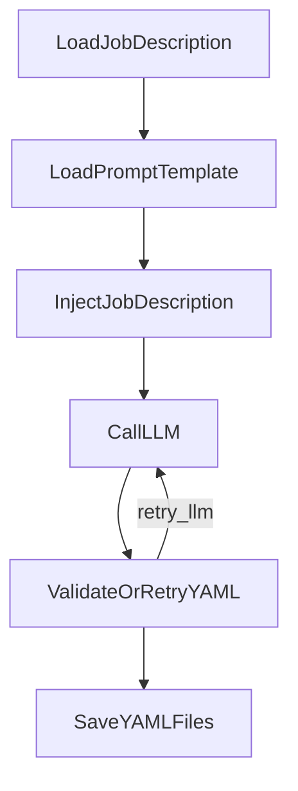

# System Patterns: ResumeCoach

## System Architecture

ResumeCoach uses a PocketFlow-based architecture to orchestrate the resume tailoring process through an agent-based workflow. The system follows a directed acyclic graph (DAG) pattern where each node in the flow represents a distinct processing step with clear inputs and outputs.

## PocketFlow Architecture

PocketFlow serves as the foundational framework for ResumeCoach, providing a minimalist yet powerful approach to building LLM-powered workflows. The core strength of PocketFlow lies in its ability to model LLM workflows as a nested directed graph:

1. **Node Structure**: Each PocketFlow Node follows a three-step execution pattern:
   - `prep(shared)`: Reads/preprocesses data from shared store, returning prep_res
   - `exec(prep_res)`: Executes compute logic (typically LLM calls), returning exec_res
   - `post(shared, prep_res, exec_res)`: Updates shared store and returns action string

2. **Flow Transitions**: Nodes are connected through action-based transitions, where:
   - Basic transitions use the syntax `node_a >> node_b` (default flow)
   - Named action transitions use `node_a - "action_name" >> node_b`
   - This allows for branching logic and conditional workflows

3. **Nested Flows**: PocketFlow supports compositional design where:
   - A Flow can act like a Node within another Flow
   - Complex workflows can be broken down into reusable sub-flows
   - Parameters cascade through the hierarchy

## Key Design Patterns

### 1. Node-Based Processing

Each step in the workflow is encapsulated as a `Node` class with three primary methods:
- `prep()`: Prepares inputs from shared state
- `exec()`: Performs the core processing logic
- `post()`: Updates shared state and determines next flow path

This pattern promotes:
- **Separation of concerns**: Each node handles a specific task
- **Testability**: Individual nodes can be tested in isolation
- **Reusability**: Nodes can be reconfigured in different flows

### 2. Shared Memory Pattern

The flow uses a shared dictionary object that persists across nodes, allowing for:
- State tracking throughout the process
- Data sharing between disconnected nodes
- Progressive enrichment of context as the flow executes

PocketFlow provides two communication approaches:
- **Shared Store** (recommended): A global data structure all nodes can access
- **Params**: Node-local configuration passed by parent flows (typically for identifiers)

### 3. Error Handling with Retry Logic

The flow implements resilience through:
- Automatic retry mechanisms with configurable `max_retries` and `wait` parameters
- YAML validation failures triggering a retry path back to the LLM
- `exec_fallback()` methods for graceful error handling

### 4. Data Transformation Pipeline

The system employs a progressive transformation pattern:
1. Raw text inputs (job descriptions, prompts)
2. Structured LLM prompts with injected content
3. Raw LLM outputs
4. Validated structured YAML data
5. Formatted output files (machine and human-readable)

### 5. Advanced Patterns

The architecture supports several additional patterns that can be applied to future development:

- **Batch Processing**: For efficiently handling large inputs or multiple iterations
- **Map-Reduce**: For parallelized processing of large documents or datasets
- **RAG (Retrieval Augmented Generation)**: For providing context to LLM responses
- **Agent-Based Decision Making**: For dynamic action selection based on context
- **Workflow Decomposition**: For breaking complex tasks into manageable steps
- **Structured Output Validation**: For ensuring LLM outputs adhere to required formats

## Component Relationships

### Input Processing
- **LoadJobDescription**: Retrieves and processes the raw job description
- **LoadPromptTemplate**: Loads the analysis prompt template
- **InjectJobDescription**: Combines the template and job text

### AI Processing
- **CallLLM**: Interfaces with the LLM service for analysis
- **ValidateOrRetryYAML**: Ensures the LLM output meets structural requirements

### Output Generation
- **SaveYAMLFiles**: Generates both machine and human-readable outputs
- Produces metadata and quality analysis in structured YAML format

## Future Component Extensions

The current implementation focuses on job description analysis, with planned extensions for:

1. **Resume Ingestion Pipeline**
   - Parse and structure existing resume text
   - Extract and categorize experience sections
   - Potential implementation using BatchNode for processing large resumes

2. **Experience Matching Engine**
   - Compare job requirements to candidate experience
   - Score and rank relevance of experiences
   - Potential implementation using RAG pattern for contextual matching

3. **Resume Generation Components**
   - Create optimized experience bullet points
   - Assemble complete tailored resume text
   - Potential implementation using Agent pattern for dynamic content generation
